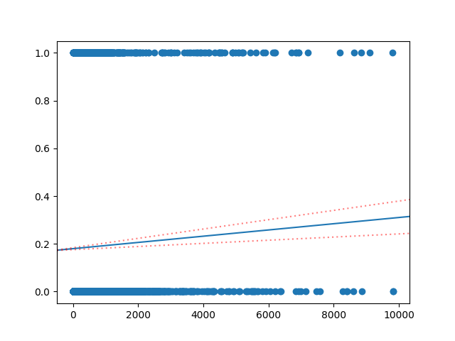

# The 5-Day Regression Challenge

This is a challenge I found when I was learning about [data cleaning](../../Learning%20Path/Kaggle/data_cleaning.md) and kind of put on the back burner, but I realise that this is a really useful skill that I'll be wanting to keep in my toolbelt, specifically in Python (but the challenge is written in R so I'll be doing my own research here). I have done a little bit from the first day of the challenge [here](../../Learning%20Path/Kaggle/data_cleaning.py), but I'd like to really dedicate some space to regression techniques here, so each day of the challenge will get its own Python file and a section in this README

## Day 1 - Regression Types

### So, what is regression?

Regression is a way of measuring the strength of a relationship between the explanatory (input, x) and response (output, y) variables of a dataset. It's similar to correlation analysis, but also allows you to make predictions from a model that relates the input and output variables.

### What types of regression are there?

The main point of this section is to explore the different types of regression. For the purposes of this challenge (I think all of it), we are looking at generalised linear models (GLM) exclusively. So that means no exponential models or anything fancy. That would narrow down our options here but honestly, there are still three main types of GLM models to look at, and they vary depending on the type of data you're giving them:

- Linear
  - For continuous scales (like temperature)
- Poisson
  - For count data (like number of bikes)
- Logistic
  - For categorical data (yes, no, maybe)

For this day, I'm gonna pick the dataset about food recipes (since I did the bikes last time).

Hopefully, throughout this, I'll be showing both Python and R scripting in tables. However, sometimes things can get a little complicated so we'll see how that goes lol.

### Performing a Regression

First, we need to read in our dataset using pandas:

| Python | R |
| ------ | - |
| <pre>import pandas as pd</br>recipes = pd.read_csv("epicurious_recipes.csv")</pre> | <pre>library(tidyverse)<br>recipes <- read_csv("epicurious_recipes.csv")</pre> |

This is going to be a pain, so I'll just show the Python and link the R from the notebook.

Let's clean the data a little by removing outliers and NaN values ([R here](https://www.kaggle.com/code/rtatman/regression-challenge-day-1?scriptVersionId=2178346&cellId=5)):

```python
recipes = recipes[recipes.calories < 10000].dropna()
```

This removes recipes that are over 10000 calories (which is a lot, but some of these are probably for multiple servings - data that is not in the dataset, weirdly)

We're going to be asking one question of this dataset: "Can we guess whether a recipe is a dessert or not based on the number of calories?"

In order to do this, we need to know what type of data dessert is. Since it's more or less a Boolean question (is or is not a dessert), we can assume this to be a categorical data type.

But what about the calories? From a scientific point of view, these are pretty obviously continuous since it is possible to have a fraction of a calorie. We can distinguish between the two by checking if the data in the column is integer or real ([R here](https://www.kaggle.com/code/rtatman/regression-challenge-day-1?scriptVersionId=2178346&cellId=7) and [here](https://www.kaggle.com/code/rtatman/regression-challenge-day-1?scriptVersionId=2178346&cellId=9)). Found a good way of doing this [here](https://stackoverflow.com/a/49249910):

```python
all(x.is_integer() for x in recipes.calories)
# OR
np.array_equal(recipes.calories, recipes.calories.astype(int))
```

If either one of these comes back true, you can say that all the values in the column are integers, and don't have any floating points.

Now we come to plotting and doing our regression. We are testing for our response variable. In this case, the response variable is our categorical dessert column. As such, we pick the binomial regression type:

| Regression | Family   | Data Type   |
| ---------- | -------- | ----------- |
| Linear     | Gaussian | Continuous  |
| Logistic   | Binomial | Categorical |
| Poisson    | Poisson  | Count       |

Plotting this is really easy in R - it has built in methods for creating a model based on GLM and can be plotted using `ggplot2` which is a wonderful package for graphing things.

I'm a difficult person so I'm going to be doing this in Python so let's do some digging into the GLM and what packages can be used to plot them.

### Seaborn

So, I have had a look into Seaborn [before](../../Learning%20Path/Kaggle/seaborn_notes.py), and it turns out their `regplot` chooses the most appropriate regression type under the hood, and plots it nice and easy for you in a single line:

```python
import seaborn as sns, matplotlib.pyplot as plt

sns.regplot(data=recipes, x="calories", y="dessert")
plt.show()
```

<p align="center">
    
</p>

So, while this is wonderful and all, we don't actually get the data back out from this. To actually get something useful from this regression test (like predicting values), we need to get the model. For this, let's introduce one of the most important statistical modelling tools in Python: `statsmodels`

### Statsmodels

The `statsmodels` package is an API that is widely used in statistical modelling (hence the name), and has its own plotting capabilities (but none as pretty as Seaborn). Both Seaborn and statsmodels use [tidy data](https://vita.had.co.nz/papers/tidy-data.pdf) to make sure it is really easy to create plots. So we can kind of bin off Seaborn at the moment if we really want to.

So how do we use `statsmodels`? There are a bunch of tools that come with this package, but for now, I'll be looking at the ones associated with our three variations of the GLM (linear, logistic, Poisson).

Let's elucidate a bit of terminology here:

- Exogenous = independent (explanatory) variable
- Endogenous = dependent (response) variable

So, if you ever see anything that says `endog` or `exog`, that's what they are.

Now, we have some tools from `statsmodels` that we can use to generate plots. Let's create and fit our model:

```python
import statsmodels.api as sm

exog = sm.add_constant(recipes.calories, prepend=False)

glm_binomial = sm.GLM(recipes.dessert, exog, 
                      family=sm.families.Binomial())
result = glm_binomial.fit()
```

So this gives us our simple binomial model, from which we can obtain various values, as well as a prediction equation from our parameters (from `result.params`). We can also get our predicted values for the model from `result.mu` for a binomial model (and `result.get_prediction().predicted_mean` for other linear models like OLS)

I went to great lengths to try to figure out how to plot this, with a shaded region for the confidence intervals around the linear model. Very difficult, but shouldn't be. I should be able to use the `fill_between()` plot, but it doesn't seem to work with the predicted means and their upper and lower bounds (not sure why, can't see a reason for it). Anyway, this is the graph that I produced using simple `abline`s from the `statsmodels` graphics package:

<p align="center">
    
</p>

It doesn't *look* any different really, so I think I'll stick to `seaborn` for simple linear regression plots, especially since I can't get the confidence interval shading to work consistently.

## Day 2 - Fitting and Evaluating a Model

## Day 3 - Reading and Understanding Models

## Day 4 - Multiple Regression Models

## Day 5 - Elastic Net
